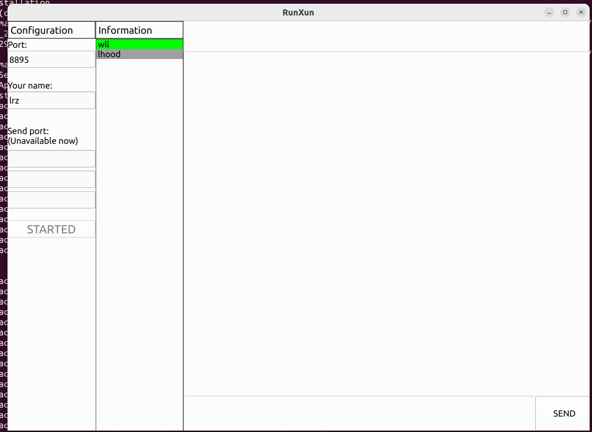
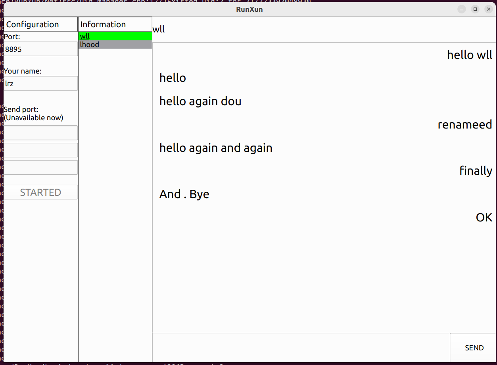
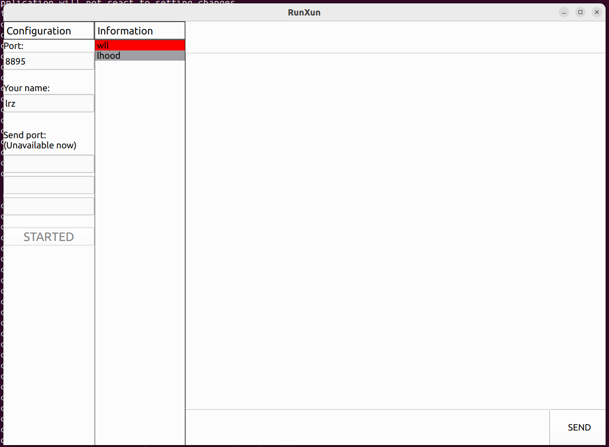

# 模块划分
## 1. 网络模块  
功能：
- 收发报文广播
- 解析报文  
  
编译：查看Net/readme.txt

## 2. 业务逻辑模块  
功能:   
- 负责组织数据发送/接收任务，比如开机自动发送的发现报文、收到消息后自动回复的确认报文等
- 管理所有聊天对象的信息：昵称、聊天记录等
- 提供设置回调函数接口，用以将各种报文事件抛出

## 3. 界面模块
使用方法:
1. 启动 sudo ./Display 注意必须要有root权限, 用于创建/读/写文件
2. 输入自己昵称后, 点击START按钮
3. 在Information栏, 有其他用户的列表. 背景灰色表示离线, 绿色则表示在线。 如图:

4. 点击想要进行聊天的用户, 则可在右边看到聊天记录. 同时被选中的用户的名称下会出现下划线 随后可以在底部的输入框发送消息, 支持回车发送. 如图:

5. 当正在聊天的以外的用户发来消息时候, information栏中的对应项背景会变成红色. 如图:

PS: GUI写的比较粗糙, 这个这个版本仅做展示了
   